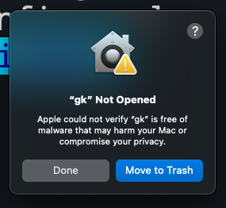
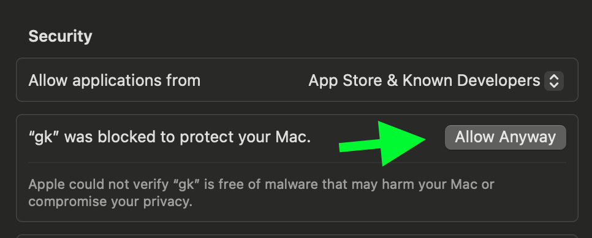
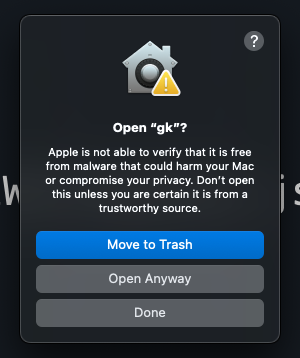

# 🚀 GitKraken CLI

`gk` is GitKraken on the command line. It provides an MCP server that streamlines working with git and your Issue and git hosting providers, making it easy to integrate powerful git operations and platform interactions directly into your AI-powered development workflow. Beyond MCP, the core CLI functionality is focused on "Work Items" which can be thought of as the feature or issue you are trying to tackle. This allows you to work with multiple repos at once and get the same UX as if you were in a monorepo. We also provide robust AI-powered commit messages and Pull Request generation.

GitKraken CLI is available on macOS, Windows, and Unix systems.


## Table of Contents

- [MCP Server](#mcp-server)
  - [Prerequisites](#prerequisites)
  - [MCP Installation](#mcp-installation)
  - [MCP Usage](#mcp-usage)
  - [Available Tools](#available-tools)
  - [Additional MCP Commands](#additional-mcp-commands)
- [CLI Documentation](#cli-documentation)
- [CLI Workflows](#cli-workflows)
- [`git` Command Passthrough](#git-command-passthrough)
- [Installation](#installation)
- [Configuration](#configuration)
- [Troubleshooting](#troubleshooting)

## MCP Server

The MCP (Model Context Protocol) server for the GitKraken CLI is a powerful and easy-to-use local server that allows your preferred MCP client to interact with git operations and development workflows. It wraps essential git actions and extends functionality to work seamlessly with pull requests and issues across multiple platforms including Azure DevOps, Bitbucket, GitHub, GitLab, Jira, and Linear, as well as providing tools to LLMs that work with GitKraken APIs.

For more information, check out the [introduction blog post](https://www.gitkraken.com/blog/introducing-gitkraken-mcp) or visit the [Help Center](https://help.gitkraken.com/cli/gk-cli-mcp/) for specific installation instructions based on your chosen AI application.

### Prerequisites

Before you begin, you need to have the GitKraken CLI (gk) installed. You can find the latest release here:

[GitKraken CLI Releases](https://github.com/gitkraken/gk-cli/releases)

### MCP Installation

Install the GitKraken MCP server directly into your compatible IDE or code editor with a simple command:

```bash
gk mcp install <PLATFORM>
```

If you need to specify a file path for the installation, you can use the --file-path option:

```bash
gk mcp install <PLATFORM> --file-path <PATH_TO_FILE>
```

#### Officially Supported IDEs

You can officially install the GitKraken MCP server in the following clients:

- vscode
- vscode-insiders
- claude
- windsurf
- cursor
- zed
- trae
- copilot
- gemini
- amazon q
- codex

### MCP Usage

To start the MCP server, simply run the following command in your terminal. This will allow your client to connect and start interacting.

```bash
gk mcp
```

### Available Tools

The MCP server provides the following tools:

- `git_add_or_commit` Add file contents to the index (git add <pathspec>) OR record changes to the repository (git commit -m <message> [files...]). Use the 'action' parameter to specify which action to perform.
- `git_blame` Show what revision and author last modified each line of a file (git blame <file>).
- `git_branch` List or create branches (git branch).
- `git_checkout` Switch branches or restore working tree files (git checkout <branch>).
- `git_log_or_diff` Show commit logs or changes between commits (git log -- oneline or git diff).
- `git_push` Update remote refs along with associated objects (git push).
- `git_stash` Stash the changes in a dirty working directory (git stash).
- `git_status` Show the working tree status (git status).
- `git_worktree` List or add git worktrees (git worktree <action>).
- `gitkraken_workspace_list` Lists all Gitkraken workspaces
- `issues_add_comment` Add a comment to an issue
- `issues_assigned_to_me` Fetch issues assigned to the user
- `issues_get_detail` Retrieve detailed information about a specific issue by its unique ID
- `pull_request_assigned_to_me` Search pull requests where you are the assignee, author, or reviewer
- `pull_request_create` Create a new pull request
- `pull_request_create_review` Create a review for a pull request
- `pull_request_get_comments` Get all the comments in a pull requests
- `pull_request_get_detail` Get an specific pull request
- `repository_get_file_content` Get file content from a repository

### Additional MCP Commands

- `gk mcp config`: Generates the necessary configuration for an MCP client to connect to this server.
- `gk mcp uninstall`: Uninstalls the MCP server from the specified client.

---

## CLI Documentation

`gk help` is going to be your best source for exploring the CLI. But also see the [workflows](#cli-workflows) below.

```bash
Welcome to GitKraken CLI, a premium CLI experience for managing multiple repositories with familiar GIT CLI commands

Usage:
  gk [flags]
  gk [command]

AUTHENTICATING
  auth         Authenticate with the GitKraken platform
  provider     Add or remove provider tokens

CORE COMMANDS
  ai           Use AI in the CLI
  graph        Display commit graph in current repository
  issue        Manage your issues
  mcp          Start a local MCP server for your favorite MCP client to interact with
  organization Manage your Gitkraken organizations
  work         Interact with your work.
  workspace    Interact with your workspaces. Alias: 'ws'

Additional Commands:
  completion   Generate completion scripts
  help         Help about any command
  setup        Display information about your current system configuration
  version      Print the version number of GK CLI

Flags:
  -h, --help   help for gk

Use "gk [command] --help" for more information about a command.
```

## CLI Workflows

Start with a single repo. You can add more later.

In general, your process will look like this:

```bash

# Authenticate
gk auth login

# Navigate to a git repo directory on your filesystem
cd ./path/to/repo

# Then create a Work Item and the current directory
# will be automatically added to the Work Item
gk work create "My new work item"

# Edit files...
# ...

# Commit your changes using AI
gk work commit --ai

# Push your changes
gk work push

# Create a Pull Request
gk work pr create --ai

```

Once you have familiarized yourself with using a single repo, try out creating work items and generating commits and PRs for multiple repos at a time by just adding multiple repos to a new Work Item.

```bash
# Add a repo to the current work item
gk work add ./path/to/repo # path could be as simple as "." if you are in the directory already
```

## `git` Command Passthrough

You can also use `gk` to pass through any `git` command. eg:

```bash
gk status
gk remote -v
# etc
```

## Installation

### macOS

`gk` is available from [Homebrew](https://formulae.brew.sh/cask/gitkraken-cli) with the following command:

Homebrew:

```bash
brew install gitkraken-cli
```

Or download it from the [releases page](https://github.com/gitkraken/gk-cli/releases) and add it to your binaries folder:

```bash
mv ~/Downloads/gk /usr/local/bin/gk
```

---

### Unix / Ubuntu

[](https://snapcraft.io/gitkraken-cli)

`gk` is available as a downloadable binary from the [releases page](https://github.com/gitkraken/gk-cli/releases). Once you have it, add it to your binaries folder:

```bash
mv ~/Downloads/gk /usr/local/bin/gk
```

Or create a new directory, move the binary and add it to $PATH:

```bash
mkdir "$HOME/cli"
mv ~/Downloads/gk "$HOME/cli"
export PATH="$HOME/gk:$PATH"
```

You can also download from the [releases page](https://github.com/gitkraken/gk-cli/releases) your corresponding package (`.deb`, `.rpm`) and install it with:

```bash
sudo apt install ./gk.deb
```

or

```bash
sudo rpm -i ./gk.rpm
```

---

### Windows

`gk` is available from [Winget](https://github.com/microsoft/winget-cli) with the following command:

```bash
winget install gitkraken.cli
```

## Configuration

### Nerd Fonts

The GitKraken CLI supports Nerd Fonts to display icons for some commands. To ensure correct icon rendering, please obtain and install a Nerd Font available at https://www.nerdfonts.com/. After installation, set the selected Nerd Font as the default font for your terminal.

## Troubleshooting

### `gk login` freezes after authenticating in browser

This problem is due to the browser. Currently we know that Safari and Brave do not allow to respond to localhost through port 1314. To fix this, change your default browser or copy the URL before the redirect and open it in another browser.

### gk from Oh-My-Zsh

Oh-My-Zsh has `gitk` aliased as `gk` and that can create some problems. To fix this, type in your terminal:

```
unalias gk
```

### Manual macOS Installation

If you install the CLI manually from the releases page on macOS, you will likely run into a security error that looks like this:



To fix this, go to Settings > Security & Privacy > General and click "Allow Anyway".



Try running `gk setup` again and then click "Open Anyway" to continue.


